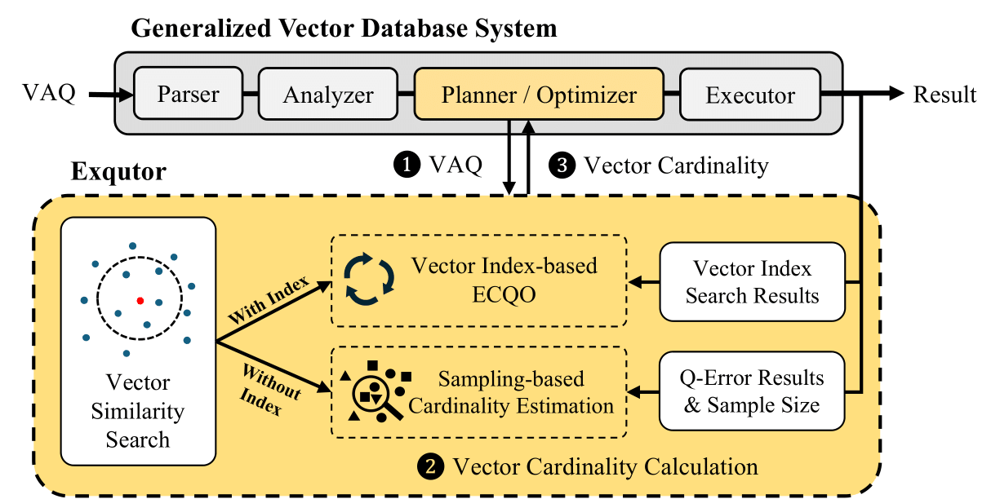

<div align="center">
  <h1>
    &nbsp; Exqutor: Extended Query Optimizer for Vector-augmented Analytical Queries
  </h1>
</div>

**Exqutor** is an **extended query optimizer** designed to improve **vector-augmented analytical queries (VAQs)** by enhancing cardinality estimation in vector search operations. With the rise of **Retrieval-Augmented Generation (RAG)** and **table-augmented generation**, modern analytical workloads increasingly integrate structured relational data with vector similarity searches. However, existing database optimizers struggle with **inaccurate cardinality estimation** for vector search operations, leading to inefficient query execution plans.

## System Design
- **Exact Cardinality Query Optimization (ECQO)**: Leverages vector indexes (e.g., HNSW, IVF) to retrieve exact cardinality estimates during query planning.
- **Adaptive Sampling-Based Cardinality Estimation**: Dynamically adjusts the sample size to improve accuracy for queries without vector indexes.
- **Seamless Integration**: Implemented in **PostgreSQL** and **DuckDB**, demonstrating performance improvements of up to **three orders of magnitude** in vector-augmented analytical queries.
- **Optimized for Vector-Augmented SQL Analytics**: Supports complex **joins, aggregations, and filters** alongside vector similarity search.

<div align="center">
  
</div>

## Getting Started

### Installation

#### PostgreSQL

1. Install pgvector and pg_hint_plan
```sh
cd PostgreSQL/pgvector
# Modify Makefile
# PG_CONFIG ?= pg_config
# to 
# PG_CONFIG ?= path/to/pg_config
vim Makefile
make 
sudo make install

cd ../pg_hint_plan
# Modify Makefile
# PG_CONFIG ?= pg_config
# to 
# PG_CONFIG ?= path/to/pg_config
vim Makefile
make 
sudo make install
```

2. Setup Vector-augmented_SQL_analytics

Update the CSV path in `tpch-load.sql`.

Insert data using `tpch-load.sql` and `insert_partsupp_deep_PostgreSQL.py`.

Execute the following scripts in order:
- `tpch-pkeys.sql`
- `tpch-alter.sql`
- `tpch-index.sql`

#### DuckDB

1. Install DuckDB-VSS
```sh
cd DuckDB/duckdb-vss
make
```

2. Setup Vector-augmented_SQL_analytics

Update the CSV path in `tpch-load.sql`.

Insert data using `tpch-load.sql` and `insert_partsupp_deep.py`.

Execute the following scripts in order:
- `tpch-pkeys.sql`
- `tpch-alter.sql`
- `tpch-index.sql`

### Run VAQs

Use the queries in `Vector-augmented_SQL_analytics/queries` to execute VAQs.

#### Using HNSW index

To utilize the HNSW vector index, use the following code:

Build HNSW index

```sql
# PostgreSQL pgvector
CREATE INDEX partsupp_hnsw ON partsupp USING hnsw (ps_embedding vector_l2_ops) WITH (m = 16, ef_construction = 128);

# query options
SET hnsw.ef_search = 400;

# Add the following to the beginning of your query to force hnsw index search
/*+
    indexscan(partsupp partsupp_hnsw)
*/
```

```sql
# DuckDB-VSS
CREATE INDEX partsupp_hnsw on partsupp USING HNSW (ps_embedding) with (metric = 'l2sq');
SET hnsw_enable_experimental_persistence = true;

# query options
SET hnsw_ef_search = 400;
```