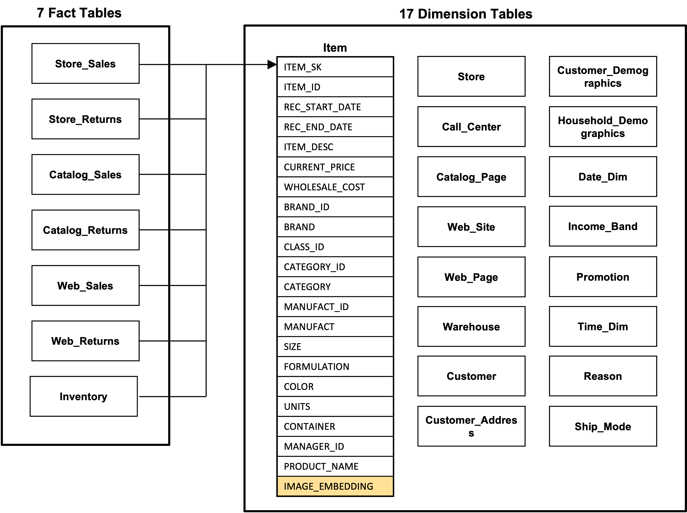

# Vector-augmented SQL Analytics (TPC-DS version)

## Database and Schema
The schema is based on the TPC-DS benchmark, extended with vector columns for `image_embedding` in the `item` table. `image_embedding` is a vector column that stores vector embeddings.

  

## Queries
The benchmark includes 7 queries that are extensions of the TPC-DS benchmark queries: Q7, Q12, Q19, Q20, Q42, Q72, and Q98. Those queries are selected to utilize the vector column `image_embedding` in the `item` table and cover a variety of classes of queries mentioned in the [TPC-DS specification](https://www.tpc.org/TPC_Documents_Current_Versions/pdf/TPC-DS_v4.0.0.pdf), such as reporting queries, ad-hoc queries, iterative OLAP queries, and data mining queries. 