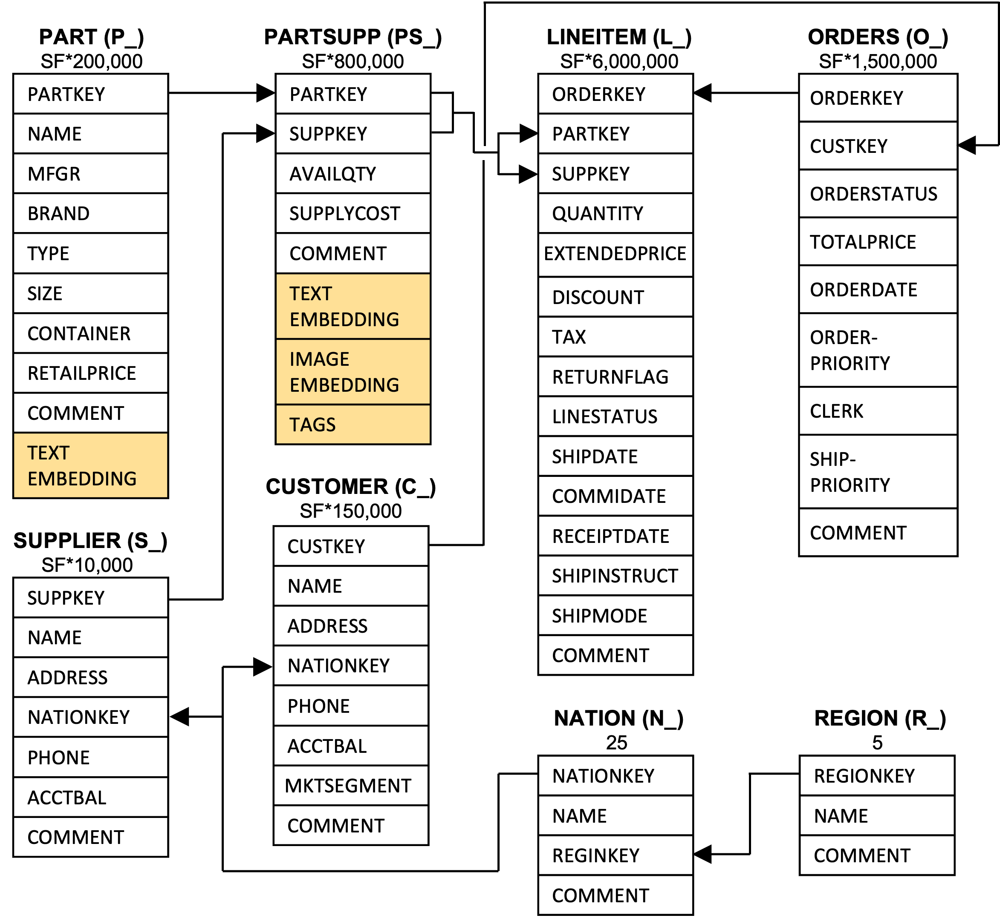

# Vector-augmented SQL Analytics (TPC-H version)

## Database and Schema
The schema is based on the TPC-H benchmark, extended with vector columns for the `part` and `partsupp` tables. `p_embedding` in the `part` table and `ps_embedding` in the `partsupp` table are vector columns that store vector embeddings, and `ps_tags` in the `partsupp` table is an array of int tags which has correlation with the vector embeddings.

  

### Vector Datasets
Vector-augmented SQL analytics integrates five vector embedding datasets: DEEP (96 dimensions), SIFT (128 dimensions), SimsearchNet++ (256 dimensions), YFCC (192 dimensions), and WIKI (768 dimensions). Each dataset can be inserted into the vector columns, `p_embedding` in the `part` table and `ps_embedding` in the `partsupp` table.

DEEP, SIFT, SimsearchNet++, and YFCC are image embeddings, while WIKI are text embeddings. In addition, `ps_tags` in the `partsupp` table is an array of int tags, which can be used for tag-based filtering. In this benchmark, YFCC dataset is used for correlation with `ps_embedding` and `ps_tags` in the `partsupp` table.

## Queries
The benchmark includes 8 queries that are extensions of the TPC-H benchmark queries: Q3, Q5, Q8, Q9, Q10, Q12, and Q20. Those queries uses directly or indirectly vector operations `partsupp` table which contains vector columns `ps_embedding` and `ps_tags`. 

For vector operations, Vector-augmented SQL analytics supports vector distance threshold, denoted as *`ps_embedding <-> ${vector_embedding} < ${threshold}`*. 
