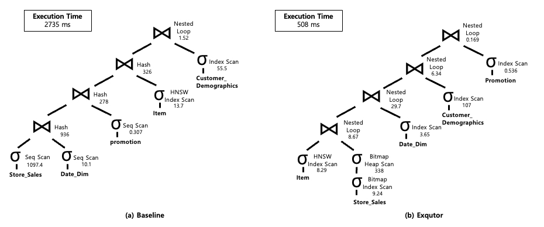
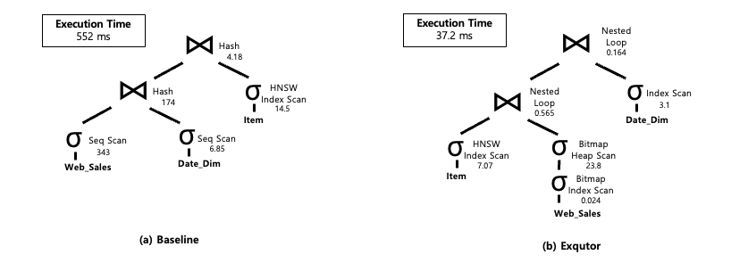
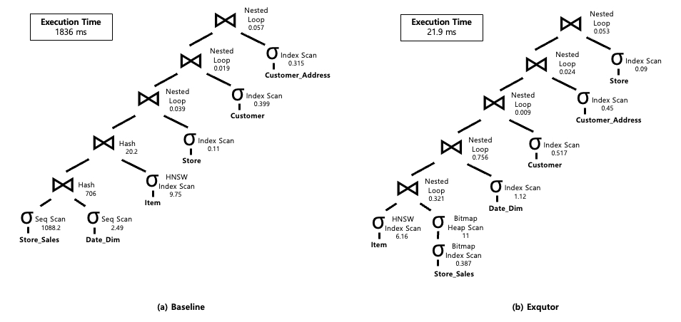

# Exqutor TPC-H Query Plans

## Exqutor with Vector Indexes (ECQO)
An optimization technique for VAQs with vector indexes, integrating ECQO into query planning by applying ANN searches only to vector tables. These results are reused at execution time without incurring redundant overhead.
### TPC-H Q3 Query Plan

  

### TPC-H Q5 Query Plan

  

### TPC-H Q8 Query Plan

  

### TPC-H Q9 Query Plan

    

### TPC-H Q10 Query Plan

    

### TPC-H Q11 Query Plan

    

### TPC-H Q12 Query Plan

    

### TPC-H Q20 Query Plan

    

 

## Exqutor without Vector Indexes (Sampling)
A sampling-based cardinality estimation approach for VAQs without vector indexes. Exqutor employs adaptive sampling to improve accuracy by dynamically adjusting the sample size based on Q-Error through a momentum-based adjustment mechanism and
a learning rate scheduler.

### TPC-H Q3 Query Plan

    

### TPC-H Q8 Query Plan

    

  

### TPC-H Q10 Query Plan

    

 

### TPC-H Q12 Query Plan

    

 

# Exqutor TPC-DS Query Plans

### TPC-DS Q7 Query Plan

    

### TPC-DS Q12 Query Plan

    

### TPC-DS Q19 Query Plan

    

