# Exqutor Query Plans

## Exqutor with Vector Indexes (ECQO)
### TPC-H Q3 Query Plan

  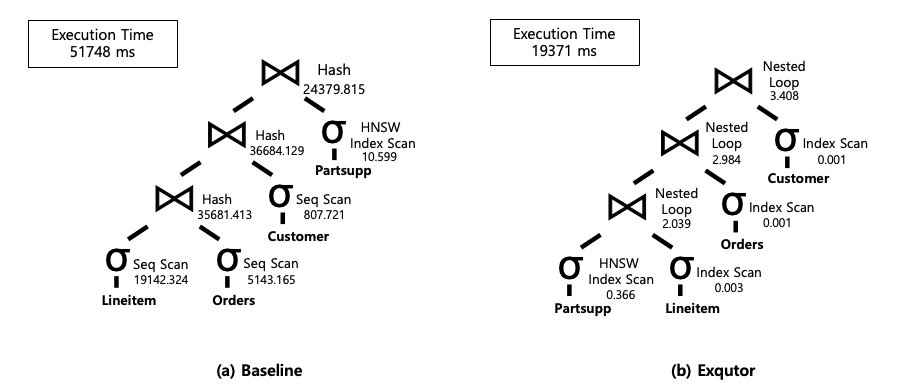

### TPC-H Q5 Query Plan

  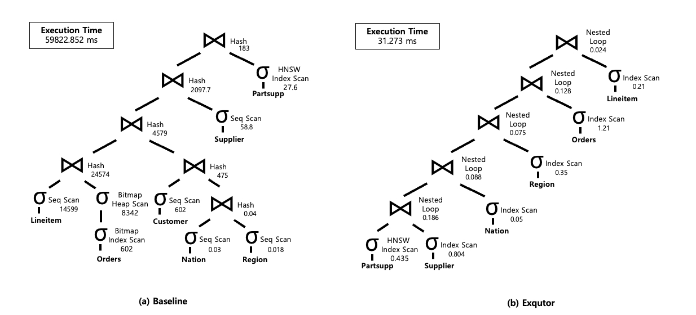

### TPC-H Q8 Query Plan

  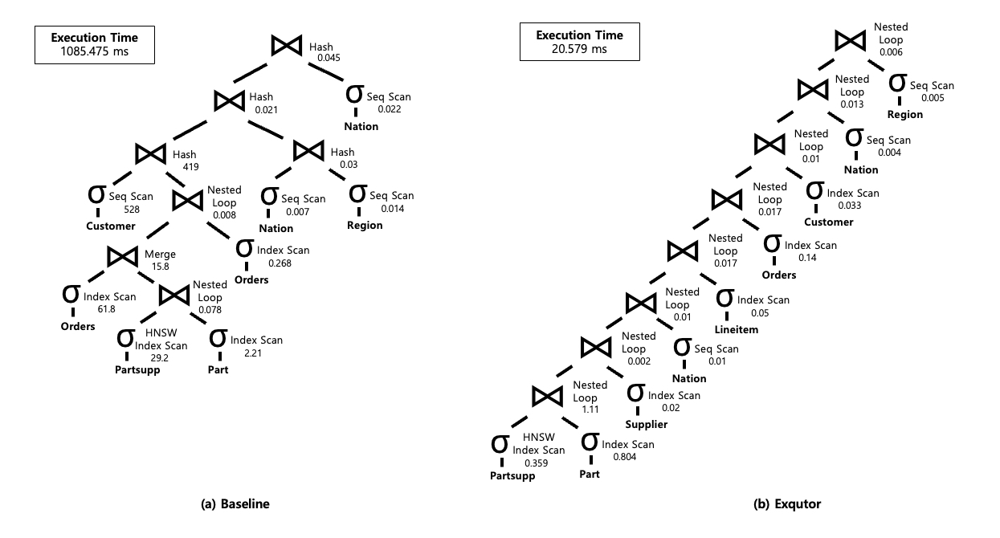

### TPC-H Q9 Query Plan

    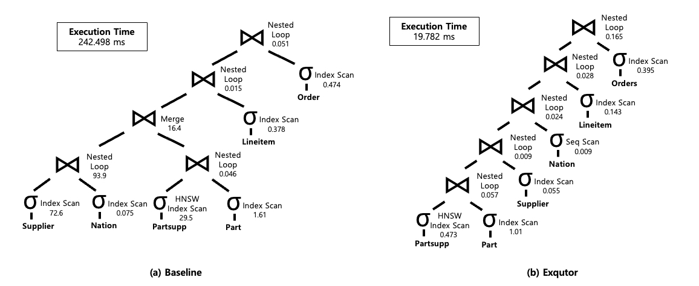

### TPC-H Q10 Query Plan

    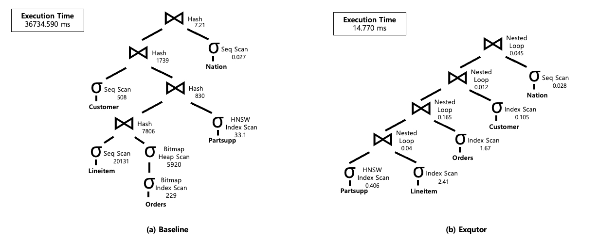

### TPC-H Q11 Query Plan

    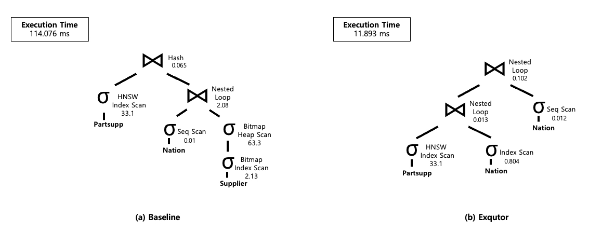

### TPC-H Q12 Query Plan

    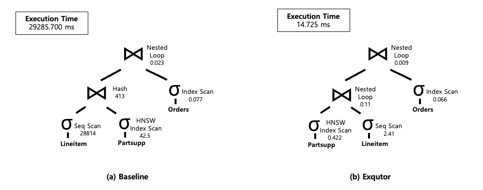

### TPC-H Q20 Query Plan

    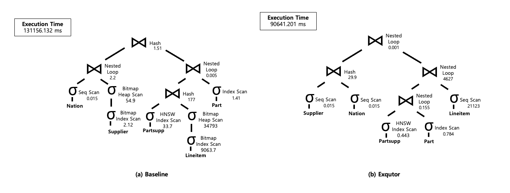

 

## Exqutor without Vector Indexes (Adaptive Sampling)
### TPC-H Q3 Query Plan

    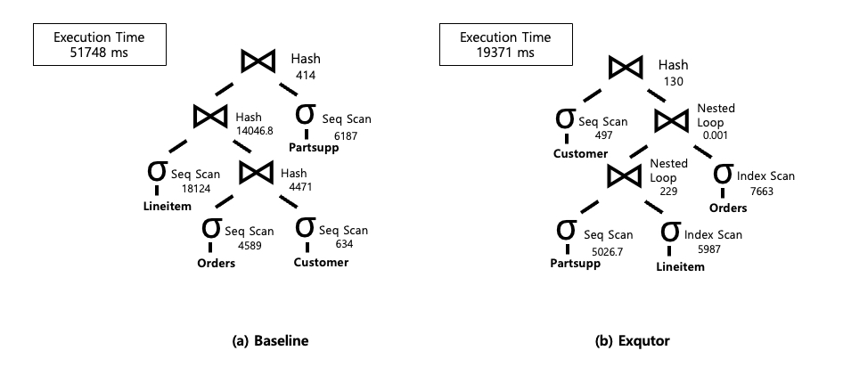

### TPC-H Q8 Query Plan

    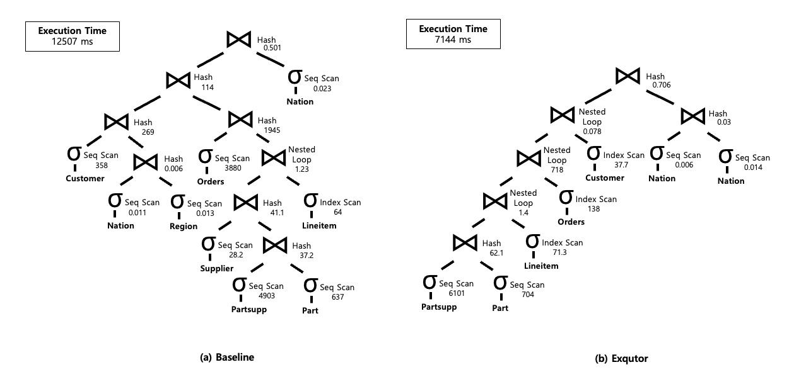

  

### TPC-H Q10 Query Plan

    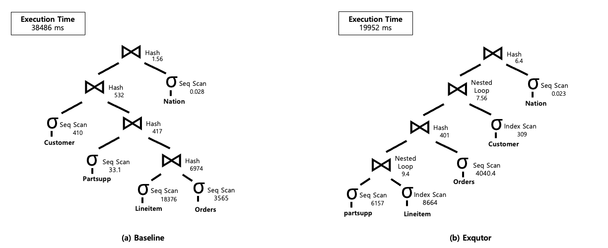

 

### TPC-H Q12 Query Plan

    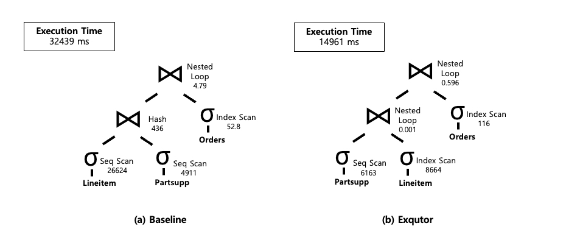

